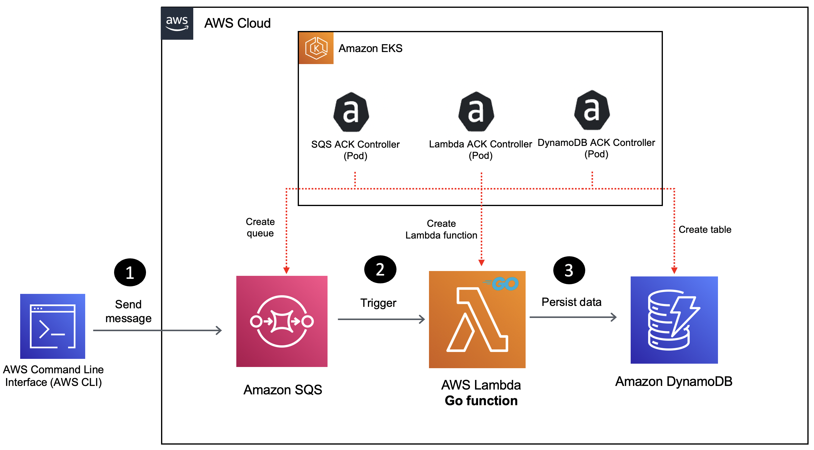

# Using ACK controllers for AWS Lambda, SQS and DynamoDB

Use [AWS Controllers for Kubernetes](https://aws-controllers-k8s.github.io/community/docs/community/overview/) EKS to put together a solution wherein data from an [Amazon SQS queue](https://docs.aws.amazon.com/AWSSimpleQueueService/latest/SQSDeveloperGuide/sqs-queue-types.html) is processed by an AWS [Lambda function](https://docs.aws.amazon.com/lambda/latest/dg/welcome.html) and persisted to a [DynamoDB](https://docs.aws.amazon.com/dynamodb/index.html) table.

